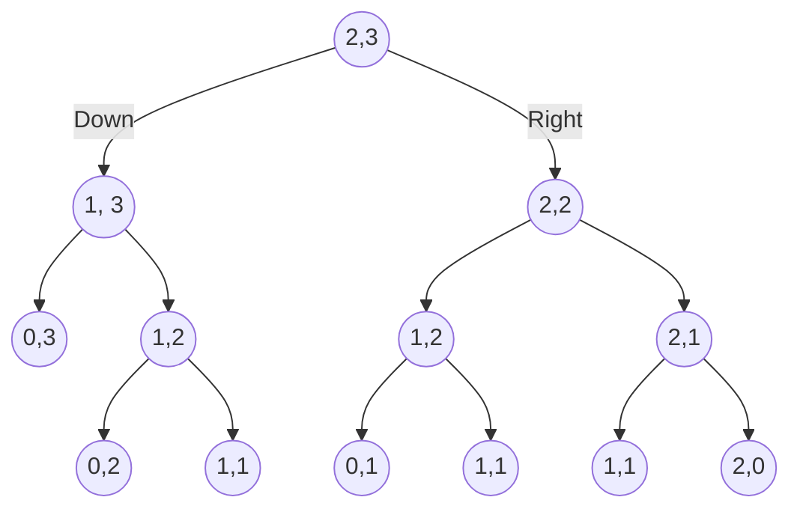
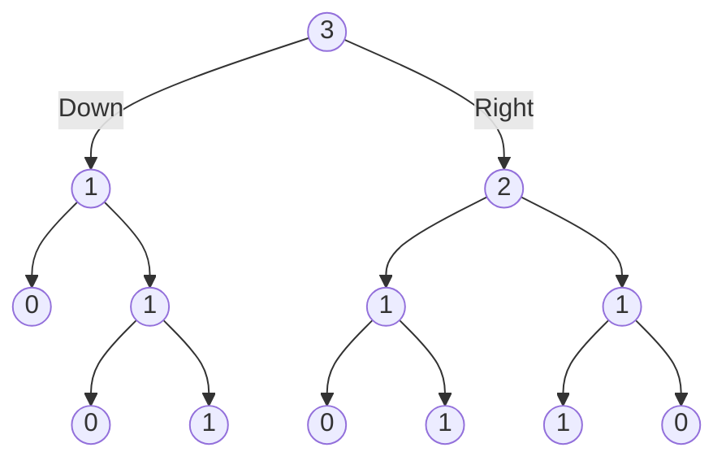

# Grid Traveler Problem


You're a traveler on a 2D grid. You start in the top-left corner, and your goal is to get to the bottom-right corner.
You may only move **down** or **right**.

How many ways can you travel to the goal in a  n * m matrix?

Function: grid_traveler(m, n)

## Thought Process

### Simple Example

We should always start with a simple example to make a DP problem approachable.

Let's start with a 2x3 grid, grid_traveler(2, 3)

| S |   |   |
|---|---|---|
|   |   | E |

There are 3 ways to travel through this

| X |   |   |
|---|---|---|
| X | X | X |
--------------

| X | X |   |
|---|---|---|
|   | X | X |
--------------

| X | X | X |
|---|---|---|
|   |   | X |


### Deriving Base Case

Next it's important to figure out what's the smallest valid grid we can have

grid_traveler(1, 1)

| S/E  |
|---|

There is only one path and that is 1. So this "subproblem" is already solved if we see this.

What if one of our inputs is 0 for m or n? In that case, we are saying 0 rows, or 0 columns. This is not a valid grid, so we would return 0

Knowing grid_traveler(1, 1) returns 1 and grid_traveler(0, 0) returns 0 is a great way to already understand what our **base case** is!

### Identifying Subproblems

Now let's think of slightly bigger parameters.

grid_traveler(3, 3)

| S |   |   |
|---|---|---|
|   |   |   |
|   |   | E |

Note something important!


There's a subproblem grid_traveler(2, 3) living in here!


|   |   |   |
|---|---|---|
| - | - | - |
| - | - | - |

This is the key insight that this is a DP problem, because there are **overlapping subproblems**

aka grid_traveler(3, 3) overlaps with grid_traveler(2, 3), etc. 

### Tree-Based Visualization

Going back to the grid_traveler(2, 3) problem, let's visualize it as a tree to easily see how the recursion would work.

Starting at root node or position (2,3) to represent the problem of grid_travelers (2, 3)

We have 2 options:

- Child can go down (going left) row -1
- Child can go right (going right) column - 1




Leaf nodes with 0, will return 0. Nodes with 1,1 or base case will return 1

Parent nodes should add left and right child node to get their value. All the way until the parent node.

This graph shows the answers for each of these nodes when translating the above tree to the recursively resolved paths



Looking at it this way, this is quite similar to how we would create the fibonacci memoized solution. This is a common theme with DP problems.

### Creating an initial Recursive Algorithm
```run-python
def grid_traveler(m, n):

    # Get base cases we figured out done first
    if m == 1 and n == 1:
        return 1
    if m == 0 or n == 0:
        return 0

    return grid_traveler(m-1, n) + grid_traveler(m, n-1)

# Works no problem!

print(grid_traveler(2, 3))

# Way too slow
#print(grid_traveler(18, 18))
print(grid_traveler(4, 3))

```

